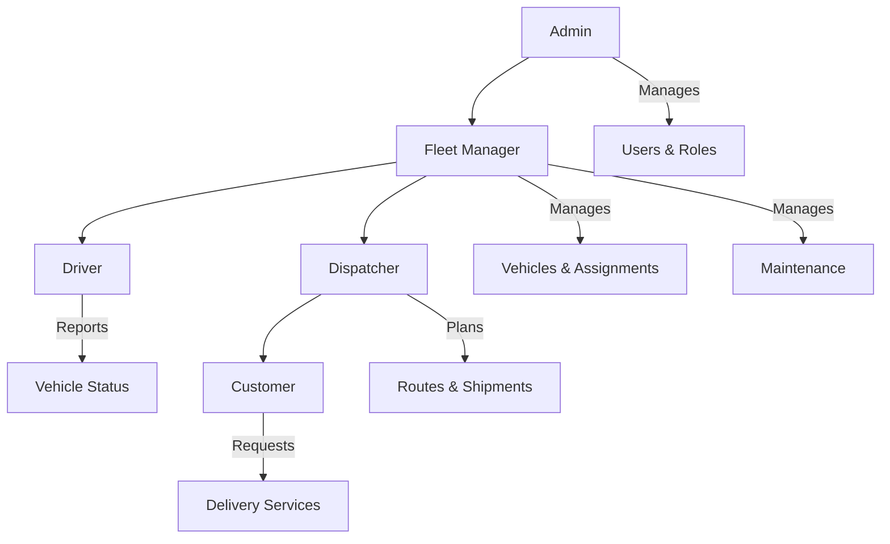
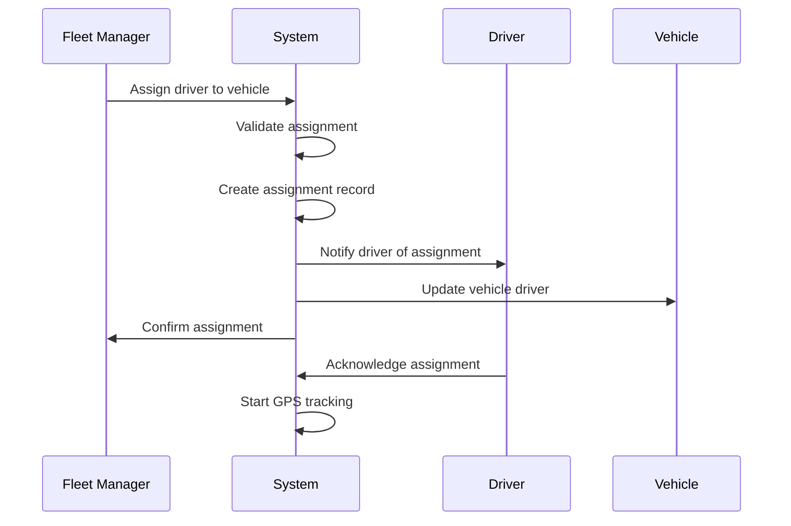
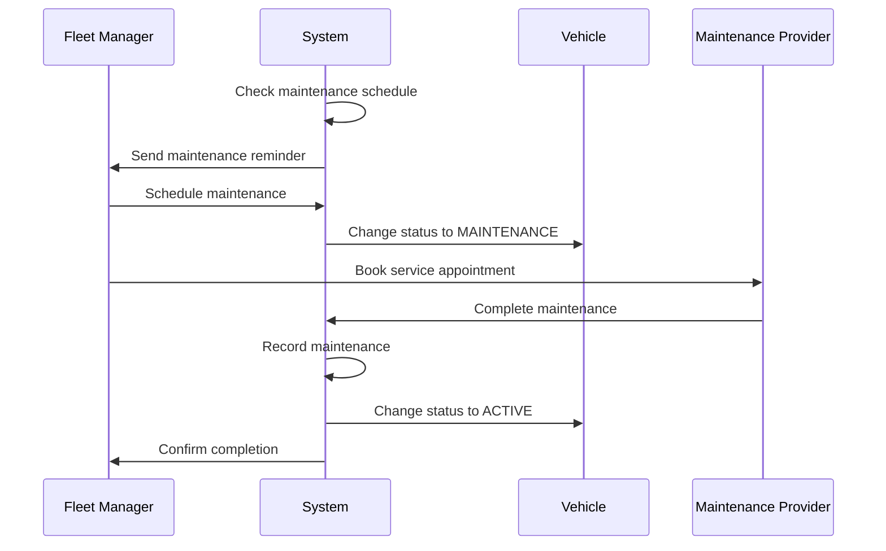
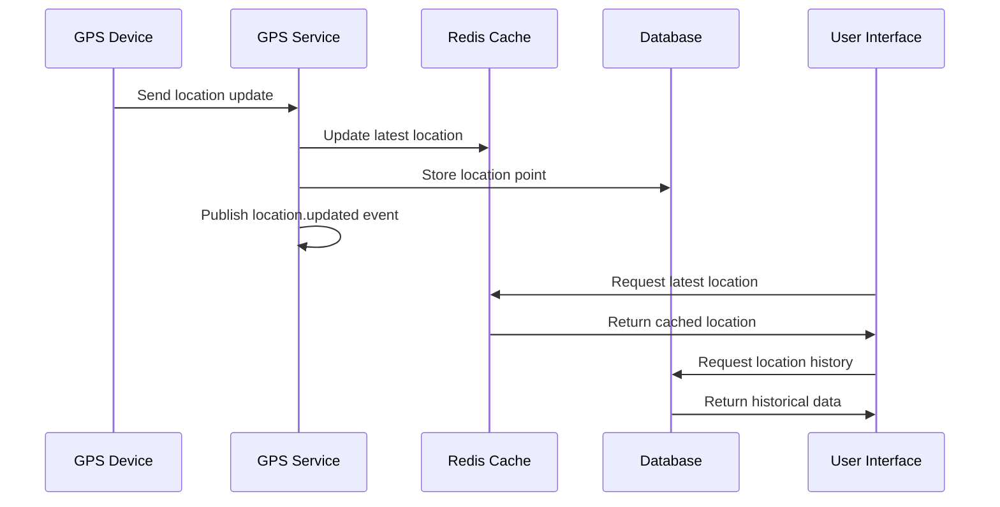
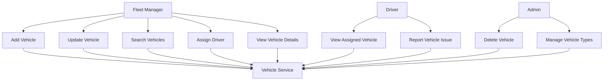
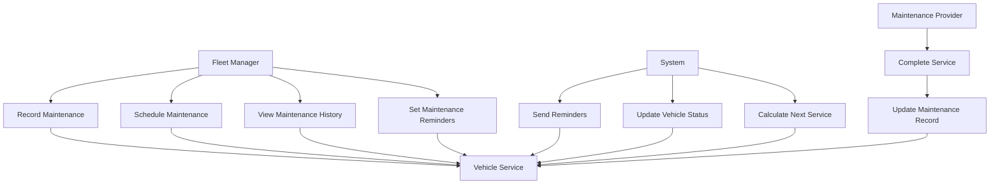
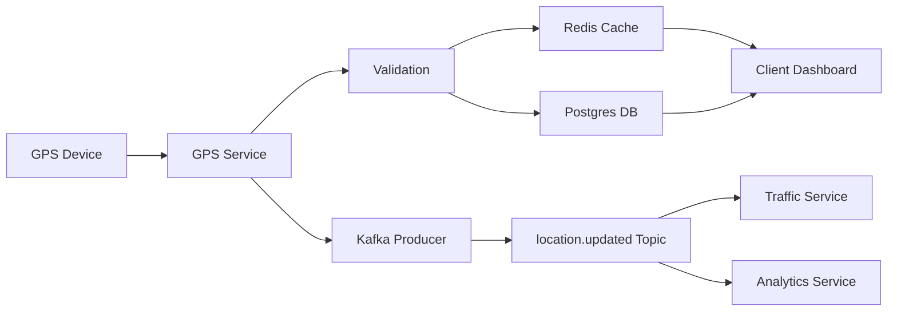
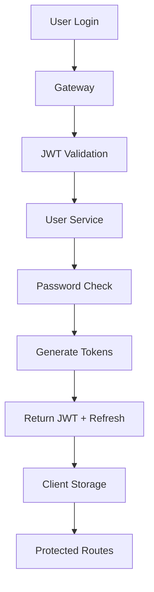

# Transportation Management System (TMS) - Functional Requirements

## 1. Overview
This document defines the functional requirements for the Transportation Management System, including user stories, use cases, acceptance criteria, and workflow diagrams.

## 2. User Roles and Personas

### 2.1 Primary Users
- **Fleet Manager**: Oversees vehicle operations, assignments, and maintenance
- **Driver**: Operates vehicles and reports issues
- **Admin**: Manages users, roles, and system configuration
- **Customer**: Places shipment requests (Phase 2)
- **Dispatcher**: Plans routes and coordinates deliveries (Phase 2)

### 2.2 User Role Hierarchy

## 3. Core Features by Service

### 3.1 Authentication & User Management

#### User Stories
- **US-001**: As a new user, I want to register an account so that I can access the system
- **US-002**: As a user, I want to login securely so that I can access my dashboard
- **US-003**: As a user, I want to reset my password so that I can regain access if forgotten
- **US-004**: As an admin, I want to manage user roles so that I can control system access
- **US-005**: As a user, I want to update my profile so that my information stays current

#### Acceptance Criteria
- **AC-001**: User can register with email, username, and password (min 12 chars)
- **AC-002**: System validates email format and checks for duplicates
- **AC-003**: Password must meet security requirements (breach check)
- **AC-004**: Login returns JWT token with 15-minute expiry
- **AC-005**: Refresh token allows seamless re-authentication
- **AC-006**: Admin can assign roles: admin, fleet_manager, driver, dispatcher
- **AC-007**: Role changes take effect immediately

### 3.2 Vehicle Management

#### User Stories
- **US-006**: As a fleet manager, I want to add vehicles so that I can track my fleet
- **US-007**: As a fleet manager, I want to search vehicles so that I can find specific ones
- **US-008**: As a fleet manager, I want to update vehicle information so that records stay accurate
- **US-009**: As a fleet manager, I want to assign drivers to vehicles so that operations run smoothly
- **US-010**: As a driver, I want to view my assigned vehicle details so that I know what I'm driving

#### Acceptance Criteria
- **AC-008**: Vehicle creation requires: registration number, VIN, make, model, year, license plate
- **AC-009**: System prevents duplicate registration numbers and VINs
- **AC-010**: Vehicle search supports filters: make, model, year, status, owner
- **AC-011**: Driver assignment creates assignment record with start/end times
- **AC-012**: Only one active driver per vehicle at a time
- **AC-013**: Vehicle status updates: ACTIVE, MAINTENANCE, RETIRED, RENTED

### 3.3 Maintenance Management

#### User Stories
- **US-011**: As a fleet manager, I want to record maintenance so that I can track vehicle health
- **US-012**: As a fleet manager, I want to schedule maintenance so that vehicles stay operational
- **US-013**: As a fleet manager, I want to view maintenance history so that I can make informed decisions
- **US-014**: As a system, I want to send maintenance reminders so that nothing is missed

#### Acceptance Criteria
- **AC-014**: Maintenance record includes: type, description, cost, service date, next service date
- **AC-015**: System calculates next maintenance based on mileage/time intervals
- **AC-016**: Maintenance reminders sent 7 days before due date
- **AC-017**: Maintenance history shows chronological list with costs
- **AC-018**: Vehicle status automatically changes to MAINTENANCE during service

### 3.4 GPS Tracking & Location Services

#### User Stories
- **US-015**: As a fleet manager, I want to track vehicle locations so that I know where my fleet is
- **US-016**: As a fleet manager, I want to view location history so that I can analyze routes
- **US-017**: As a driver, I want to see my current location so that I can navigate effectively
- **US-018**: As a system, I want to receive GPS updates so that tracking is accurate

#### Acceptance Criteria
- **AC-019**: GPS updates received every 30 seconds for active vehicles
- **AC-020**: Location data includes: lat, lon, speed, heading, accuracy, timestamp
- **AC-021**: Latest location cached for quick access (< 150ms response)
- **AC-022**: Location history queryable by date range and vehicle
- **AC-023**: System handles GPS signal loss gracefully
- **AC-024**: Location data retained for 90 days, aggregated for longer periods

### 3.5 Traffic & Route Optimization

#### User Stories
- **US-019**: As a fleet manager, I want accurate ETAs so that I can plan deliveries
- **US-020**: As a dispatcher, I want traffic-aware routing so that I can optimize efficiency
- **US-021**: As a driver, I want real-time traffic updates so that I can avoid delays
- **US-022**: As a system, I want to adjust ETAs based on traffic so that estimates are accurate

#### Acceptance Criteria
- **AC-025**: ETA calculations consider current traffic conditions
- **AC-026**: Traffic incidents cached and updated every 5 minutes
- **AC-027**: Route optimization suggests fastest path considering traffic
- **AC-028**: ETA adjustments communicated to relevant users
- **AC-029**: Traffic alerts sent for severe incidents affecting planned routes

## 4. User Journey Diagrams

### 4.1 Driver Assignment Workflow

### 4.2 Maintenance Workflow

### 4.3 GPS Tracking Workflow

## 5. Feature Mapping to Services

### 5.1 Phase 1 Features (MVP)
| Feature | Service | Priority | Dependencies |
|---------|---------|----------|--------------|
| User Registration/Login | User Service | High | Auth Module |
| Vehicle CRUD | Vehicle Service | High | User Service |
| Driver Assignment | Vehicle Service | High | User Service |
| Maintenance Records | Vehicle Service | Medium | Vehicle Service |
| GPS Ingestion | GPS Service | High | Vehicle Service |
| Location Queries | GPS Service | High | GPS Ingestion |
| Traffic Data | Traffic Service | Medium | External APIs |
| Basic Dashboard | Client | High | All Services |

### 5.2 Phase 2 Features (Extended)
| Feature | Service | Priority | Dependencies |
|---------|---------|----------|--------------|
| Shipment Management | New Service | Medium | Customer Service |
| Route Planning | New Service | Medium | GPS + Traffic |
| Multi-stop Routes | Route Service | Medium | Shipment Service |
| Advanced Analytics | Analytics Service | Low | All Services |
| Mobile App | Mobile Client | Medium | All Services |
| Google Maps Integration | Map Service | Low | GPS + Traffic |

## 6. Use Case Diagrams

### 6.1 Vehicle Management Use Cases

### 6.2 Maintenance Management Use Cases

## 7. Data Flow Diagrams

### 7.1 GPS Data Flow

### 7.2 User Authentication Flow

## 8. Business Rules

### 8.1 Vehicle Assignment Rules
- A vehicle can only have one active driver at a time
- Driver must be in ACTIVE status to be assigned
- Assignment requires start time, optional end time
- Previous assignment must be closed before new assignment

### 8.2 Maintenance Rules
- Maintenance reminders sent 7 days before due date
- Vehicle status automatically changes to MAINTENANCE during service
- Maintenance cost must be recorded for financial tracking
- Next service date calculated based on mileage or time intervals

### 8.3 GPS Tracking Rules
- GPS updates required every 30 seconds for active vehicles
- Location accuracy threshold: < 10 meters
- Speed limit violations trigger alerts
- Geofence violations trigger notifications

## 9. Acceptance Testing Scenarios

### 9.1 Vehicle Assignment Test
**Given**: A fleet manager wants to assign a driver to a vehicle
**When**: The manager selects a driver and vehicle
**Then**: 
- Assignment record is created
- Driver receives notification
- Vehicle status updates
- GPS tracking starts automatically

### 9.2 Maintenance Reminder Test
**Given**: A vehicle has maintenance due in 7 days
**When**: The system checks maintenance schedule
**Then**:
- Fleet manager receives reminder
- Vehicle status can be changed to MAINTENANCE
- Maintenance record can be created

### 9.3 GPS Tracking Test
**Given**: A vehicle is active and moving
**When**: GPS device sends location update
**Then**:
- Location is stored in database
- Latest location cached in Redis
- Location.updated event published
- Dashboard shows real-time location

## 10. Non-Functional Requirements Summary

### 10.1 Performance Requirements
- Vehicle search response time: < 250ms
- GPS latest location query: < 150ms
- User authentication: < 200ms
- Dashboard load time: < 2 seconds

### 10.2 Availability Requirements
- System uptime: 99.9%
- GPS tracking uptime: 99.5%
- Maintenance reminders: 100% delivery

### 10.3 Security Requirements
- Password complexity enforcement
- JWT token expiration
- Role-based access control
- Audit logging for all actions

## 11. Feature Prioritization Matrix

| Feature | Business Value | Technical Effort | Priority |
|---------|---------------|------------------|----------|
| User Authentication | High | Medium | 1 |
| Vehicle CRUD | High | Low | 2 |
| GPS Tracking | High | High | 3 |
| Driver Assignment | High | Medium | 4 |
| Maintenance Records | Medium | Low | 5 |
| Traffic Integration | Medium | Medium | 6 |
| Route Planning | Medium | High | 7 |
| Advanced Analytics | Low | High | 8 |

## 12. Success Criteria

### 12.1 MVP Success Criteria
- Users can register, login, and manage vehicles
- Fleet managers can assign drivers to vehicles
- GPS tracking provides real-time location data
- Maintenance records can be created and viewed
- System handles 100 concurrent users

### 12.2 Phase 2 Success Criteria
- Shipment management with route optimization
- Mobile app for drivers
- Advanced reporting and analytics
- Integration with external mapping services
- System handles 1000 concurrent users

---

*This document should be reviewed and updated as requirements evolve and new features are identified.*

