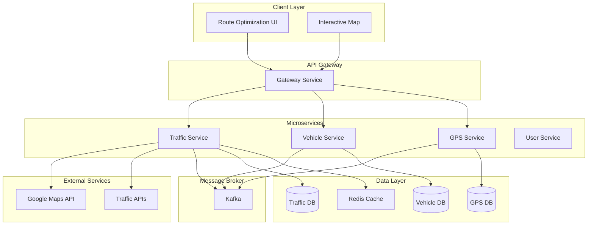
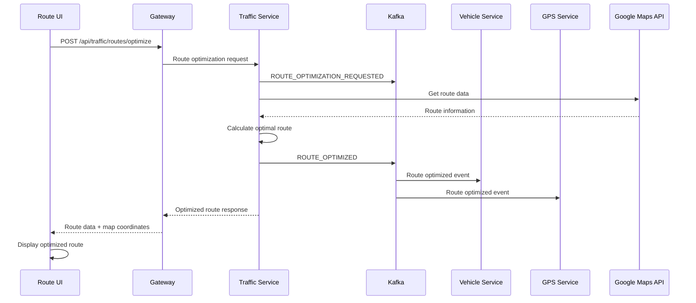
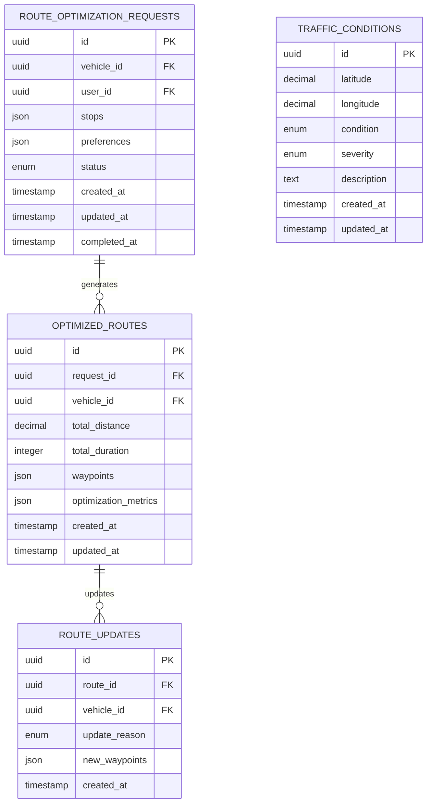
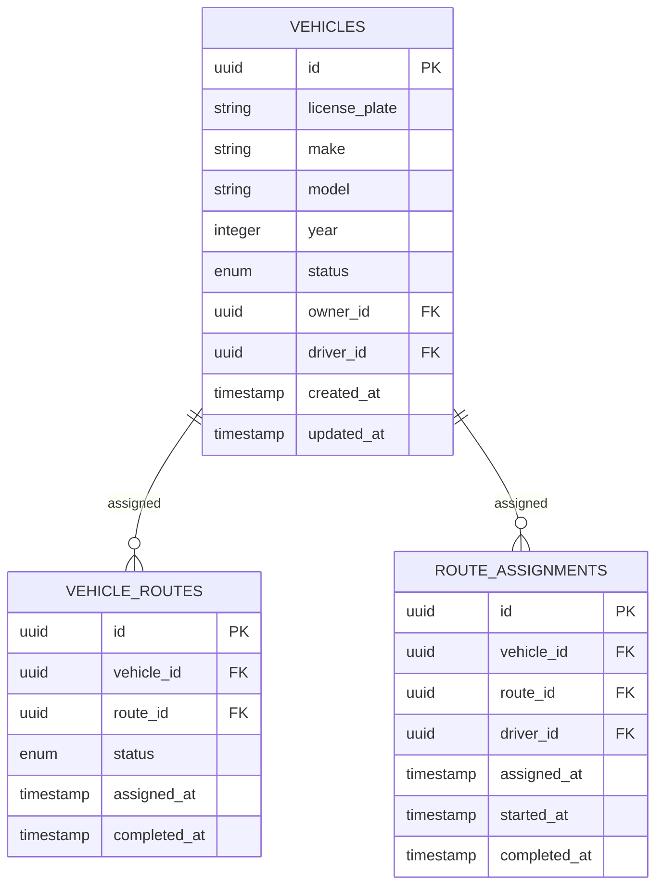

# Route Optimization Feature - Technical Specification

## 1. Overview

This document outlines the implementation of a **Basic Route Optimization** feature for the Transportation Management System (TMS). The feature provides intelligent route planning and optimization capabilities using Kafka events for real-time communication between microservices.

### 1.1 Feature Scope
- **Single Vehicle Route Optimization**: Optimize routes for one vehicle with multiple stops
- **Real-time Route Updates**: Dynamic route adjustments based on traffic conditions
- **Event-Driven Architecture**: Kafka-based communication for loose coupling
- **Google Maps Integration**: External API integration for route calculation
- **Interactive UI**: Map-based interface for route visualization

### 1.2 Business Value
- **Cost Reduction**: Optimize fuel consumption and travel time
- **Efficiency Improvement**: Reduce total distance and delivery time
- **Real-time Adaptability**: Adjust routes based on current traffic conditions
- **Scalability**: Event-driven architecture supports future enhancements

## 2. Technical Architecture

### 2.1 System Components



### 2.2 Event Flow Architecture



## 3. Database Schema

### 3.1 Traffic Service Database Schema



### 3.2 Enhanced Vehicle Service Schema



## 4. API Specifications

### 4.1 Route Optimization Endpoints

#### 4.1.1 Optimize Route
```http
POST /api/traffic/routes/optimize
Authorization: Bearer <jwt-token>
Content-Type: application/json

{
  "vehicleId": "uuid",
  "stops": [
    {
      "id": "stop-1",
      "latitude": 40.7128,
      "longitude": -74.0060,
      "address": "123 Main St, New York, NY",
      "priority": 1
    },
    {
      "id": "stop-2", 
      "latitude": 40.7589,
      "longitude": -73.9851,
      "address": "456 Broadway, New York, NY",
      "priority": 2
    }
  ],
  "preferences": {
    "avoidTolls": false,
    "avoidHighways": false,
    "optimizeFor": "time"
  }
}
```

**Response:**
```json
{
  "success": true,
  "data": {
    "requestId": "uuid",
    "optimizedRoute": {
      "totalDistance": 15.5,
      "totalDuration": 1800,
      "waypoints": [
        {
          "latitude": 40.7128,
          "longitude": -74.0060,
          "address": "123 Main St, New York, NY",
          "estimatedArrival": "2025-01-21T10:00:00Z"
        }
      ]
    },
    "optimizationMetrics": {
      "timeSaved": 300,
      "distanceSaved": 2.1,
      "fuelSaved": 0.5
    }
  }
}
```

#### 4.1.2 Get Route Status
```http
GET /api/traffic/routes/{requestId}/status
Authorization: Bearer <jwt-token>
```

#### 4.1.3 Update Route
```http
PUT /api/traffic/routes/{routeId}/update
Authorization: Bearer <jwt-token>
Content-Type: application/json

{
  "reason": "traffic_change",
  "currentLocation": {
    "latitude": 40.7500,
    "longitude": -73.9900
  }
}
```

### 4.2 Real-time Updates

#### 4.2.1 WebSocket Connection
```javascript
const ws = new WebSocket('ws://localhost:4000/ws/routes');
ws.onmessage = (event) => {
  const data = JSON.parse(event.data);
  if (data.type === 'ROUTE_UPDATED') {
    updateRouteDisplay(data.route);
  }
};
```

## 5. Kafka Events Specification

### 5.1 Event Types

#### 5.1.1 Route Optimization Requested
```typescript
interface RouteOptimizationRequestedEvent extends BaseEvent {
  eventType: 'ROUTE_OPTIMIZATION_REQUESTED'
  data: {
    requestId: string
    vehicleId: string
    userId: string
    stops: Array<{
      id: string
      latitude: number
      longitude: number
      address: string
      priority?: number
    }>
    preferences: {
      avoidTolls: boolean
      avoidHighways: boolean
      optimizeFor: 'time' | 'distance' | 'fuel'
    }
  }
}
```

#### 5.1.2 Route Optimized
```typescript
interface RouteOptimizedEvent extends BaseEvent {
  eventType: 'ROUTE_OPTIMIZED'
  data: {
    requestId: string
    vehicleId: string
    optimizedRoute: {
      totalDistance: number
      totalDuration: number
      waypoints: Array<{
        latitude: number
        longitude: number
        address: string
        estimatedArrival: string
      }>
    }
    optimizationMetrics: {
      timeSaved: number
      distanceSaved: number
      fuelSaved: number
    }
  }
}
```

#### 5.1.3 Route Update Requested
```typescript
interface RouteUpdateRequestedEvent extends BaseEvent {
  eventType: 'ROUTE_UPDATE_REQUESTED'
  data: {
    vehicleId: string
    routeId: string
    currentLocation: {
      latitude: number
      longitude: number
    }
    reason: 'traffic_change' | 'driver_request' | 'emergency'
  }
}
```

### 5.2 Kafka Topics

| Topic | Description | Consumers |
|-------|-------------|-----------|
| `route-optimization-events` | Route optimization requests and results | Traffic Service, Vehicle Service, GPS Service |
| `route-update-events` | Route update requests and notifications | Traffic Service, Vehicle Service, Client |

## 6. Implementation Plan

### 6.1 Phase 1: Core Infrastructure (Day 1)
- [ ] Create route optimization database schema
- [ ] Implement basic route optimization service
- [ ] Add Google Maps API integration
- [ ] Create route optimization endpoints

### 6.2 Phase 2: Event Integration (Day 2)
- [ ] Implement Kafka event publishers
- [ ] Add event consumers in Vehicle and GPS services
- [ ] Create real-time WebSocket updates
- [ ] Add route status tracking

### 6.3 Phase 3: UI Implementation (Day 3)
- [ ] Create route optimization UI components
- [ ] Implement interactive map with route visualization
- [ ] Add real-time route updates
- [ ] Create route comparison features

## 7. Technical Requirements

### 7.1 Performance Requirements
- **Route Optimization Response Time**: < 5 seconds
- **Real-time Updates**: < 2 seconds latency
- **Concurrent Requests**: Support 100+ simultaneous optimizations
- **Database Queries**: < 200ms for route lookups

### 7.2 Scalability Requirements
- **Horizontal Scaling**: Support multiple Traffic Service instances
- **Event Processing**: Handle 1000+ events per minute
- **Database Performance**: Optimize for read-heavy workloads
- **Cache Strategy**: Redis caching for frequently accessed routes

### 7.3 Security Requirements
- **Authentication**: JWT-based authentication for all endpoints
- **Authorization**: Role-based access control (fleet managers, drivers)
- **API Rate Limiting**: 100 requests per minute per user
- **Data Validation**: Input validation for all route parameters

### 7.4 Reliability Requirements
- **Availability**: 99.9% uptime for route optimization
- **Error Handling**: Graceful degradation when external APIs fail
- **Event Guarantees**: At-least-once delivery for critical events
- **Backup Strategy**: Database backups and event replay capability

## 8. External Dependencies

### 8.1 Google Maps API
- **Directions API**: Route calculation and optimization
- **Geocoding API**: Address to coordinates conversion
- **Places API**: Location search and validation
- **Rate Limits**: 1000 requests per day (free tier)

### 8.2 Traffic Data APIs
- **Real-time Traffic**: Current traffic conditions
- **Historical Data**: Traffic patterns for optimization
- **Incident Data**: Road closures and accidents
- **Weather Integration**: Weather impact on routes

## 9. Monitoring and Observability

### 9.1 Metrics
- **Route Optimization Success Rate**: Percentage of successful optimizations
- **Average Optimization Time**: Time taken to calculate routes
- **Event Processing Latency**: Time from event publish to consumption
- **API Response Times**: Endpoint performance metrics

### 9.2 Logging
- **Structured Logging**: JSON format for all services
- **Event Tracking**: Log all route optimization events
- **Error Logging**: Detailed error information for debugging
- **Performance Logging**: Track optimization algorithm performance

### 9.3 Alerting
- **High Error Rate**: Alert when optimization failure rate > 5%
- **Slow Response Times**: Alert when average response time > 10 seconds
- **Event Processing Delays**: Alert when event processing lag > 30 seconds
- **External API Failures**: Alert when Google Maps API is unavailable

## 10. Testing Strategy

### 10.1 Unit Tests
- **Route Optimization Algorithm**: Test optimization logic
- **Event Publishers**: Test Kafka event publishing
- **Event Consumers**: Test event consumption and processing
- **API Endpoints**: Test all route optimization endpoints

### 10.2 Integration Tests
- **End-to-End Workflows**: Test complete route optimization flow
- **Event Flow**: Test event publishing and consumption
- **External API Integration**: Test Google Maps API integration
- **Database Operations**: Test route data persistence

### 10.3 Performance Tests
- **Load Testing**: Test with 100+ concurrent requests
- **Stress Testing**: Test system limits and failure scenarios
- **Event Processing**: Test high-volume event processing
- **Database Performance**: Test query performance under load

## 11. Deployment Considerations

### 11.1 Environment Configuration
- **Development**: Local Kafka, Google Maps API sandbox
- **Staging**: Production-like environment with limited API quotas
- **Production**: Full Google Maps API access, monitoring, alerting

### 11.2 Database Migrations
- **Schema Updates**: Version-controlled database migrations
- **Data Migration**: Migrate existing route data if applicable
- **Rollback Strategy**: Ability to rollback schema changes

### 11.3 Feature Flags
- **Route Optimization**: Toggle feature on/off per environment
- **External API Integration**: Toggle Google Maps API usage
- **Real-time Updates**: Toggle WebSocket functionality
- **Event Processing**: Toggle Kafka event processing

## 12. Future Enhancements

### 12.1 Advanced Optimization
- **Multi-Vehicle Optimization**: Vehicle Routing Problem (VRP) solver
- **Dynamic Re-optimization**: Real-time route adjustments
- **Machine Learning**: Predictive route optimization
- **Fuel Optimization**: Eco-friendly route suggestions

### 12.2 Additional Features
- **Route Sharing**: Share optimized routes between drivers
- **Route Templates**: Save and reuse common routes
- **Analytics Dashboard**: Route optimization performance metrics
- **Mobile Integration**: Mobile app for drivers

### 12.3 Integration Enhancements
- **Weather Integration**: Weather-based route adjustments
- **Traffic Prediction**: Predictive traffic modeling
- **Geofencing**: Location-based route triggers
- **Third-party Integrations**: Waze, TomTom, etc.

## 13. Risk Assessment

### 13.1 Technical Risks
- **External API Dependencies**: Google Maps API rate limits and availability
- **Event Processing**: Kafka message ordering and delivery guarantees
- **Database Performance**: Query performance under high load
- **Real-time Updates**: WebSocket connection stability

### 13.2 Mitigation Strategies
- **API Fallbacks**: Alternative routing providers
- **Event Replay**: Kafka event replay for failed processing
- **Database Optimization**: Proper indexing and query optimization
- **Connection Management**: Robust WebSocket connection handling

## 14. Success Criteria

### 14.1 Functional Success
- [ ] Route optimization reduces travel time by 15% on average
- [ ] Real-time route updates work within 2 seconds
- [ ] System handles 100+ concurrent optimization requests
- [ ] 99.9% uptime for route optimization service

### 14.2 Technical Success
- [ ] All unit tests pass with 90%+ coverage
- [ ] Integration tests validate end-to-end workflows
- [ ] Performance tests meet response time requirements
- [ ] Monitoring and alerting are fully operational

### 14.3 Business Success
- [ ] Fleet managers can optimize routes in under 5 seconds
- [ ] Drivers receive real-time route updates
- [ ] System reduces fuel consumption by 10% on average
- [ ] User satisfaction score > 4.5/5

---

**Document Version**: 1.0  
**Last Updated**: January 21, 2025  
**Author**: Development Team  
**Reviewers**: Architecture Team, Product Team
