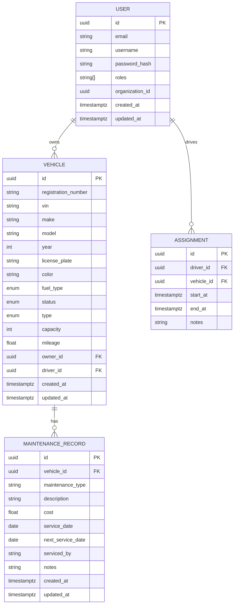
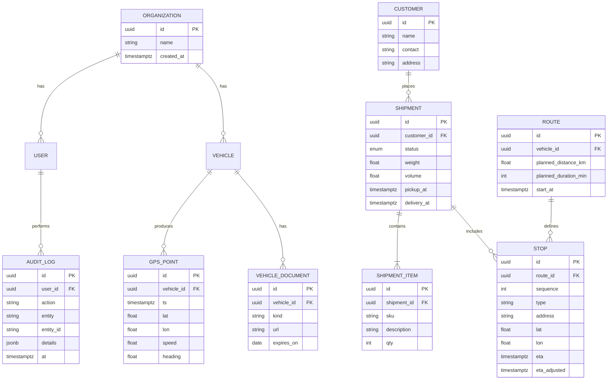

# Transportation Management System (TMS) - Technical Requirements

## 1. Scope and Goals
- **Purpose**: Provide a modular, scalable Transportation Management System using microservices.
- **Objectives**:
  - Manage users, vehicles, assignments, and maintenance.
  - Track vehicles in real-time and adjust ETAs using traffic data.
  - Provide secure APIs via a gateway and stream domain events via Kafka.
  - Support future logistics features (shipments, routes, stops) and Google Maps-like capabilities.

## 2. Architecture Overview
- **Style**: Microservices on Kubernetes
- **Services**:
  - Gateway/API (NestJS)
  - User Service (NestJS + Postgres)
  - Vehicle Service (NestJS + Prisma + Postgres)
  - GPS Service (NestJS + Postgres/TimescaleDB + Redis)
  - Traffic Service (NestJS + external APIs + Redis)
  - Shared Common Library `@yatms/common` (DTOs, guards, pipes, utils)
- **Communication**:
  - Synchronous: REST through Gateway
  - Asynchronous: Kafka topics for domain events
- **Persistence**: Postgres per service (DB-per-service), Redis for caching
- **Infra**: Kubernetes (Deployments, Services, Ingress), Skaffold for local/dev, GitHub Actions/CI

## 3. Services and Responsibilities
### 3.1 Gateway
- JWT verification, request context propagation, rate limiting, CORS
- Routing to downstream services: `/api/users`, `/api/vehicles`, `/api/gps`, `/api/traffic`, `/api/auth`
- Error normalization, API Docs (OpenAPI), request logging

### 3.2 User Service
- User CRUD, auth (register, login, refresh, logout), roles/permissions
- Organizations/tenants (optional in phase 2)
- Emits events: `user.created`, `user.updated`, `user.deleted`

### 3.3 Vehicle Service
- Vehicle CRUD, search/filter
- Driver assignments history and maintenance records
- Documents (registration, insurance) with object storage links
- Emits events: `vehicle.created`, `vehicle.updated`, `maintenance.created`

### 3.4 GPS Service
- Ingest high-frequency GPS points (HTTP/MQTT)
- Store time-series data; maintain latest location cache
- Publish `location.updated`; provide history and latest queries

### 3.5 Traffic Service
- Fetch and cache external traffic/incidents
- ETA adjustment endpoints; publish `traffic.alert`

## 4. APIs (High Level)
- Gateway routes map to services. Each service exposes REST with validation (Zod) and guards.
- Standard response envelope and error codes. Idempotency keys for POST (where applicable).

## 5. Data Model and ERDs

### 5.1 Phase 1 ERD (Users, Vehicles, Maintenance)


### 5.2 Extended ERD (Shipments, Routes, Telemetry)


## 6. Security Requirements
- Authentication and authorization
  - JWT at gateway using RS256 and JWKS endpoint; rotate keys every 90 days
  - Access token TTL 15 minutes; Refresh token TTL 14 days with rotation on each refresh
  - Token revocation list stored in Redis; logout invalidates refresh token family
  - Propagate `x-auth-user-*` and `x-request-id`; add `x-correlation-id` if absent
  - Service-to-service authorization via mTLS (cluster-internal) or signed service tokens
- RBAC and input validation
  - RBAC via `RolesGuard`; permissions model extensible to resource-level policies
  - Validate all inputs at the edge using Zod; reject on first error with 400 + error codes
- Data protection
  - Secrets via K8s Secrets/SealedSecrets; no secrets in images or env-committed files
  - PII encryption at rest (Postgres pgcrypto or KMS envelope) for sensitive fields
  - TLS termination at ingress; internal mTLS preferred for high-sensitivity environments
- Security SLAs and controls
  - Password policy: min 12 chars, breach check, rate-limited login (5/min/IP)
  - Audit logging for auth events, privilege changes, data exports
  - Dependency scanning and image vulnerability scans on CI; critical vulns block deploy

## 7. Observability Requirements
- Tracing
  - OpenTelemetry for HTTP client/server and Kafka producers/consumers
  - Propagate `traceparent` across gateway and services; include `x-request-id`
  - Export to OTLP Collector → Tempo/Jaeger with 10% sampling in prod (configurable)
- Metrics
  - Prometheus scraping with per-service `/metrics`
  - Standard RED metrics: requests, errors, duration (p50/p90/p95/p99)
  - Business metrics: vehicles online, GPS ingest rate, ETA error, Kafka lag
- Logging
  - Structured JSON logs including `timestamp`, `level`, `service`, `requestId`, `userId`
  - Central aggregation to Loki/ELK; 14–30 days retention per environment
- SLOs (initial targets)
  - Availability: 99.9% for gateway, 99.5% for core services
  - Latency (p95): gateway < 300 ms; GPS latest lookup < 150 ms; vehicle CRUD < 250 ms
  - Error rate: < 0.5% 5xx per service (rolling 1h)

## 8. Resilience and Performance
- Network robustness
  - Timeouts: client → gateway 5s; gateway → services 3s; service → DB 2s
  - Retries: at-most-once for writes (idempotency keys); up to 2 retries for safe GETs with jittered backoff
  - Circuit breakers per downstream with half-open probes
- Workload isolation
  - Bulkheads: separate connection pools, thread pools, and Kafka consumer groups
  - Queue backpressure with bounded concurrency; DLQ for poison messages
- Caching and performance
  - Redis caches: latest vehicle location (TTL 30–60s), traffic incidents (TTL 1–5 min)
  - Database indexes for high-cardinality filters; Prisma connection pool sizing by CPU/DB
- Capacity planning
  - HPA: scale on CPU (60–70%) and RPS/lag metrics; Kafka partitions sized for peak ingest

## 9. Data Storage
- Postgres per service; schema ownership per team; Prisma migrations stored in repo
- GPS time-series
  - TimescaleDB hypertables or monthly partitioning
  - Spatial index (PostGIS) for geo queries; downsampled aggregates for dashboards
- Object storage for documents (S3/GCS) with signed URLs and lifecycle policies
- Data retention
  - GPS raw: 30–90 days; aggregates retained 12–24 months
  - Audit logs: 12 months (configurable); PII minimization on export

## 10. Kafka and Async Contracts
- Topics (suggested defaults; adjust partitions by load)
  - `user.created` | partitions: 3 | retention: 7d
  - `user.updated` | partitions: 3 | retention: 7d
  - `user.deleted` | partitions: 3 | retention: 7d
  - `vehicle.created` | partitions: 6 | retention: 7d
  - `vehicle.updated` | partitions: 6 | retention: 7d
  - `maintenance.created` | partitions: 3 | retention: 30d
  - `location.updated` | partitions: 12–48 | retention: 3d (high-volume)
  - `traffic.alert` | partitions: 6 | retention: 7d
- Message schema and versioning
  - JSON with schema validation in code (Zod) or Avro with Schema Registry
  - Include `schemaVersion`, `occurredAt`, `idempotencyKey`, `producer` fields
  - Backward-compatible changes; new required fields require new version
- Delivery and error handling
  - Producer: acks=all, idempotent producers; retries with exponential backoff
  - Consumer: at-least-once; transactional outbox pattern for write+publish
  - Retries: main topic → `*.retry` (delayed) → `*.dlq` after N attempts
- Sample payloads
  - `location.updated`:
    ```json
    {
      "schemaVersion": "1.0",
      "vehicleId": "uuid",
      "position": { "lat": 00.0, "lon": 00.0 },
      "speed": 12.3,
      "heading": 180,
      "accuracy": 5.5,
      "timestamp": "2025-01-01T00:00:00Z",
      "occurredAt": "2025-01-01T00:00:00Z",
      "idempotencyKey": "uuid",
      "producer": "gps-service"
    }
    ```

## 11. API Gateway Requirements
- Central auth, rate limiting (e.g., 100 req/min/user; 20 req/min/IP unauth)
- CORS: allow only trusted origins per environment; strict methods/headers
- Error mapping: standard error codes and problem+json details
- OpenAPI docs versioned; deprecations with headers and changelog

## 12. Client (Next.js) Requirements
- Auth flows with refresh token handling; secure cookie for refresh (httpOnly, SameSite)
- Protected routes via context/guards; role-based UI controls
- Vehicles/assignments/maintenance pages; real-time tracking map (Mapbox/Google Maps)
- GPS data via SSE or polling (5–10s) with backoff on errors

## 13. Google Maps-like Features (Optional Extensions)
### 13.1 Additional Services
- Map integration: Mapbox GL JS or Google Maps JS SDK; server-side tile caching optional
- Geocoding/Reverse: Mapbox/Google Geocoding API wrapper service with response caching
- Places/POI: provider wrapper with per-tenant quotas and category filters
- Navigation: route optimization and turn-by-turn steps (provider-backed initially)
### 13.2 Enhanced GPS/Traffic
- Ingestion 1–10 Hz per active vehicle; batch writes for efficiency
- Predictive ETA using provider traffic, historic speeds, and heuristics/ML (phase 2)
- Weather integration as modifier for ETA/severity
### 13.3 Frontend UX
- Interactive map with clustering; route overlays and incident markers
- Offline caching for recent tiles on mobile; optional voice guidance via Web Speech API
- Accessibility: keyboard navigation, high-contrast map styles

## 14. Deployment & CI/CD
- CI pipeline per service: lint → test → build → scan → push → deploy
- Environments: dev (Skaffold), staging, prod; separate clusters or namespaces
- Database migrations: run as pre-deploy job; block deploy on failure
- Secrets from Vault/SealedSecrets; image provenance (Sigstore) and policy

## 15. Testing Strategy
- Unit tests ≥ 70% coverage on core modules; critical paths ≥ 85%
- Integration tests with ephemeral Postgres/Redis/Kafka (Testcontainers)
- Contract tests (Pact) for REST and message schemas; provider verification in CI
- E2E through gateway (Playwright/Postman/Newman); load tests for GPS ingest using k6

## 16. Target Architecture (Suggested Technical Requirements)

### 16.1 Core Services
- **Gateway/API**: 
  - Request routing with intelligent load balancing
  - JWT verification using RS256 with JWKS endpoint
  - Rate limiting (per-user and per-IP)
  - Request logging with structured JSON
  - Tracing headers propagation (trace/span IDs)
  - Circuit breaker pattern for downstream services

- **User Service**: 
  - User management (CRUD operations)
  - Authentication (login, logout, refresh tokens)
  - Authorization (roles and permissions)
  - Session management with refresh token rotation
  - Organizations/tenants support for multi-tenancy
  - Audit logging for security events

- **Vehicle Service**: 
  - Vehicle lifecycle management
  - Driver-vehicle assignments with history tracking
  - Maintenance records and scheduling
  - Document management (registration, insurance) with object storage
  - Vehicle status tracking and alerts

- **GPS Service**: 
  - High-frequency GPS data ingestion (HTTP/MQTT)
  - Real-time location persistence
  - Event publishing for location updates
  - Geofencing capabilities
  - Location history and analytics

- **Traffic Service**: 
  - External traffic API consumption
  - Traffic incident caching and management
  - Route optimization with ETA modifiers
  - Real-time traffic alert publishing
  - Historical traffic pattern analysis

- **Optional Future Services**:
  - Order/Shipment Management
  - Dispatch/Planning Engine
  - Route Optimization Service
  - Billing and Invoicing

### 16.2 Communication Patterns
- **Synchronous Communication**:
  - REST APIs via gateway for client requests
  - Internal service-to-service communication via REST or gRPC
  - Request/response patterns with timeout handling
  - Circuit breaker implementation for resilience

- **Asynchronous Communication**:
  - Kafka topics for domain events:
    - `user.created`, `user.updated`, `user.deleted`
    - `vehicle.created`, `vehicle.updated`, `vehicle.assigned`
    - `location.updated`, `location.geofence_entered`
    - `maintenance.created`, `maintenance.due`
    - `traffic.alert`, `traffic.incident`
  - Event-driven architecture for loose coupling
  - Message ordering and idempotency guarantees

### 16.3 Data Storage Strategy
- **Primary Storage**:
  - PostgreSQL for OLTP per service (Prisma ORM)
  - Database-per-service pattern for data isolation
  - ACID compliance for transactional operations

- **Caching Layer**:
  - Redis for session management
  - Rate limiting counters
  - Hot data lookups (vehicle current location)
  - Cache invalidation strategies

- **Object Storage**:
  - S3/GCS for document storage
  - Signed URLs for secure access
  - Lifecycle policies for data retention

- **Time Series Data**:
  - PostgreSQL partitioned tables for GPS points
  - TimescaleDB for high-volume time series data
  - Spatial indexing for geographic queries
  - Data compression and retention policies

### 16.4 Security Architecture
- **Authentication**:
  - JWT with RS256 algorithm
  - Key rotation via JWKS endpoint
  - Refresh token mechanism with rotation
  - Role and permission-based access control

- **Authorization**:
  - User context propagation via headers
  - Correlation ID forwarding for tracing
  - Service-to-service authentication via mTLS
  - Internal service tokens for cross-service calls

- **Data Protection**:
  - Encryption at rest and in transit
  - PII data handling compliance
  - Secret management via KMS/SealedSecrets
  - Audit logging for security events

### 16.5 Observability Stack
- **Distributed Tracing**:
  - OpenTelemetry instrumentation
  - HTTP server/client tracing
  - Kafka producer/consumer tracing
  - Trace collection via OTLP collector
  - Visualization with Grafana Tempo/Jaeger

- **Metrics Collection**:
  - Prometheus for metrics scraping
  - Custom business metrics
  - Infrastructure metrics
  - Dashboards in Grafana

- **Centralized Logging**:
  - Structured JSON logging
  - Centralized log aggregation (ELK/Loki)
  - Log correlation with traces
  - Retention and archival policies

### 16.6 Resilience Patterns
- **Fault Tolerance**:
  - Circuit breakers for external dependencies
  - Retry mechanisms with exponential backoff
  - Timeout configurations per service
  - Idempotency keys for write operations

- **Data Consistency**:
  - Schema validation at service boundaries (Zod)
  - Event sourcing for critical operations
  - Saga pattern for distributed transactions
  - Outbox pattern for reliable messaging

### 16.7 CI/CD Pipeline
- **Per-Service Pipelines**:
  - Lint and code quality checks
  - Unit and integration testing
  - Docker image building and scanning
  - Security vulnerability scanning
  - Image push to registry

- **Deployment Strategy**:
  - Skaffold for local development
  - ArgoCD for production deployments
  - Database migrations per service
  - Blue-green or rolling deployments

### 16.8 Infrastructure Requirements
- **Kubernetes Platform**:
  - Readiness and liveness probes
  - Horizontal Pod Autoscaling (HPA)
  - Resource limits and requests
  - Service mesh (optional)

- **Networking**:
  - Ingress with TLS termination
  - Service discovery and load balancing
  - Network policies for security
  - Secret management integration

- **Message Streaming**:
  - Kafka with proper partitioning
  - Consumer group management
  - Retention policies per topic
  - Monitoring and alerting

## 17. Implementation Roadmap (Prioritized)
1) Security hardening (RS256/JWKS, request-id propagation, rate limits)
2) Complete user-service schema and auth flows (refresh rotation, revocation)
3) Vehicle assignments/documents; maintenance reminders and events
4) GPS MVP (ingest, latest, history, Redis cache, `location.updated`)
5) Traffic MVP (incidents cache, ETA adjustments, `traffic.alert`)
6) Kafka contracts, producers/consumers, retries and DLQs, outbox pattern
7) Observability stack (OTel, metrics, logs) with SLO dashboards
8) Gateway refinements (error normalization, OpenAPI, versioning)
9) Client integrations (maps, tracking, SSE) and UX hardening
10) Extended logistics (shipments/routes/stops) and planning features
